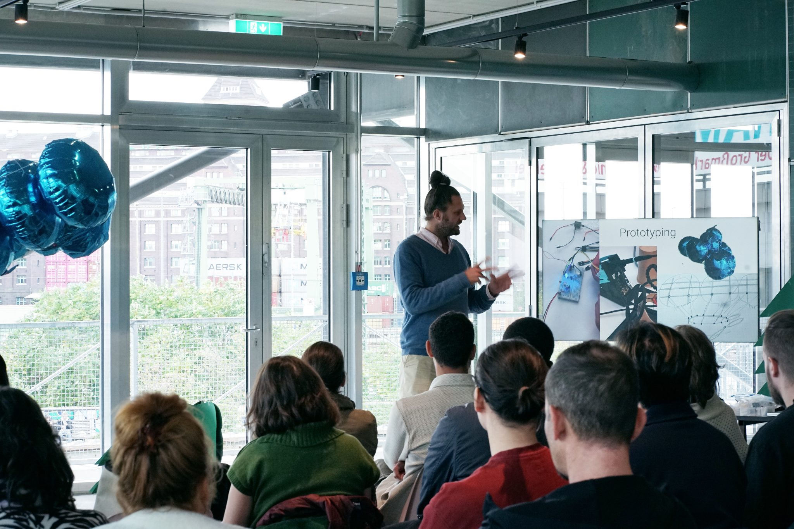
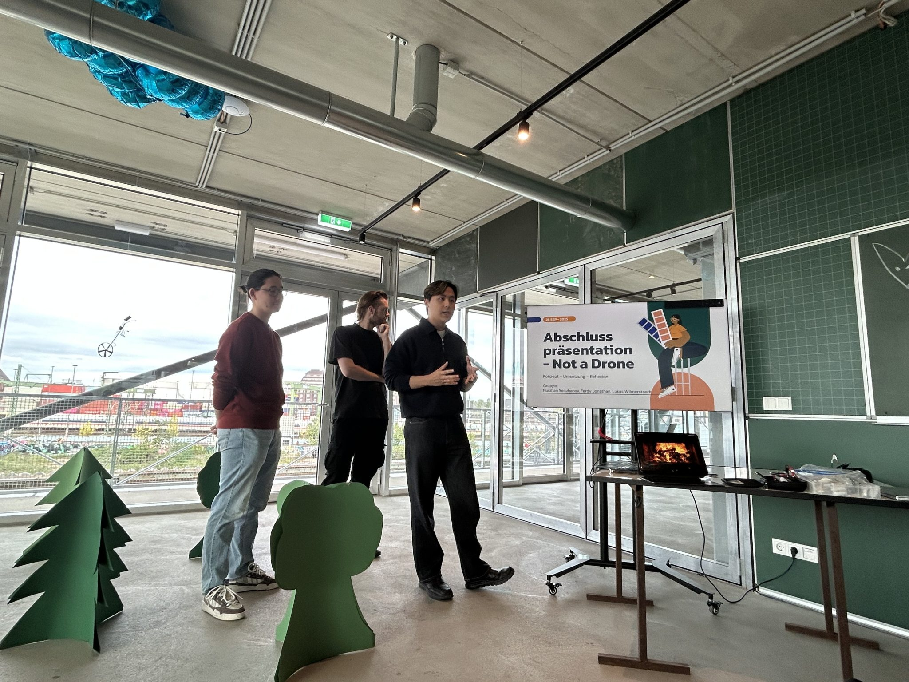
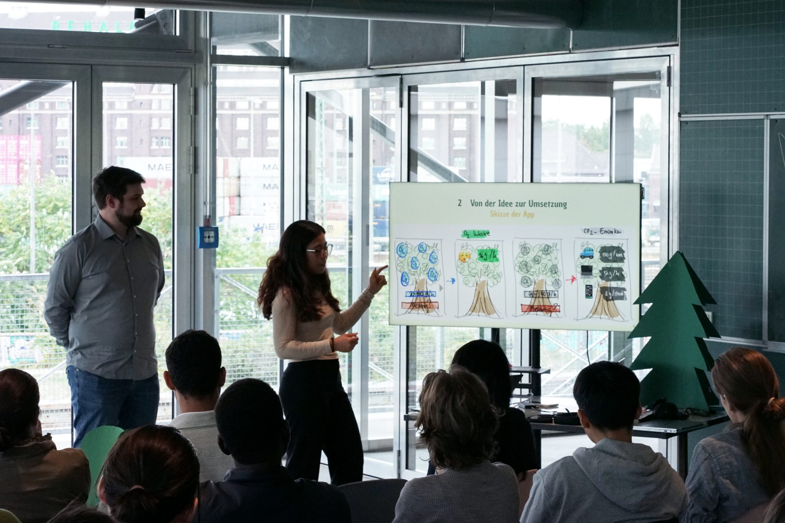

# Summer School 2025   

article on our website (English): 
https://www.lifolab.de/citylab-summer-school-2025

article on CityLab Berlin's website (German): https://citylab-berlin.org/de/blog/citylab-summer-school-2025-stadt-wald-labor/

Excerpt from articles above: 

>In light of increasingly frequent droughts and forest fires, this year we asked ourselves: What if the forest could speak to us — through sensors, data streams, and sounds? And how can digital technologies help interweave city and nature more closely?
>
>The CityLAB Summer School 2025 sought answers to exactly these questions. For two weeks, CityLAB, in cooperation with HTW Berlin, the Real-Lab Forest of TU Berlin, the Technologiestiftung Berlin and ZK/U Berlin – Center for Art and Urbanistics, transformed into a workshop for both digital and analog rustling of leaves. Flying sensors, interactive augmented-reality applications for urban spaces, and machine-learning approaches for environmental crisis scenarios were at the core. With creative uses of technology and new ecological perspectives, the relationship between humans, machines, and trees was further developed — always with the goal of connecting digital innovation and sustainability.

## Projects

### Not a Drone – Brand­erkennungs­prototyp  

https://github.com/NurzhanSeitzhanov/Not-a-Drone_Big-Data  

Dieses Projekt ist ein Prototyp auf Basis eines ESP32-S3 Mikrocontrollers, der eine Kamera, eine LED und einen Motor kombiniert, um feuerähnliche Farben zu erkennen. Das System bietet eine visuelle Rückmeldung über die LED, eine mechanische Reaktion durch den Motor sowie eine detaillierte Ausgabe über die serielle Schnittstelle.

### AR APP

https://github.com/JohannMuenchhagen/BigDataAnalytics

Dieses Projekt ist eine AR Anwendung (Augmented Reality) im Rahmen des Kurses Big Data Analytics an der HTW Berlin. Diese Anwendung basiert auf Node.js und AR.js.

### InTheWoods

https://github.com/thitrunganhnguyen/InTheWoods

Edge-Impulse-basiertes Objekterkennungs-Projekt für das Seeed XIAO ESP32S3 CAM.  
Ziel: Baum/Hindernis erkennen und per LEDs/Lüftern eine einfache Ausweichlogik ansteuern.

## Always-Included-Links (to do)

links to lifo website, relevant outside stuff